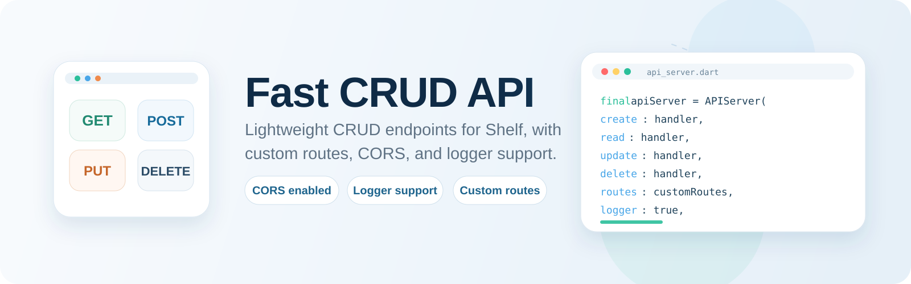
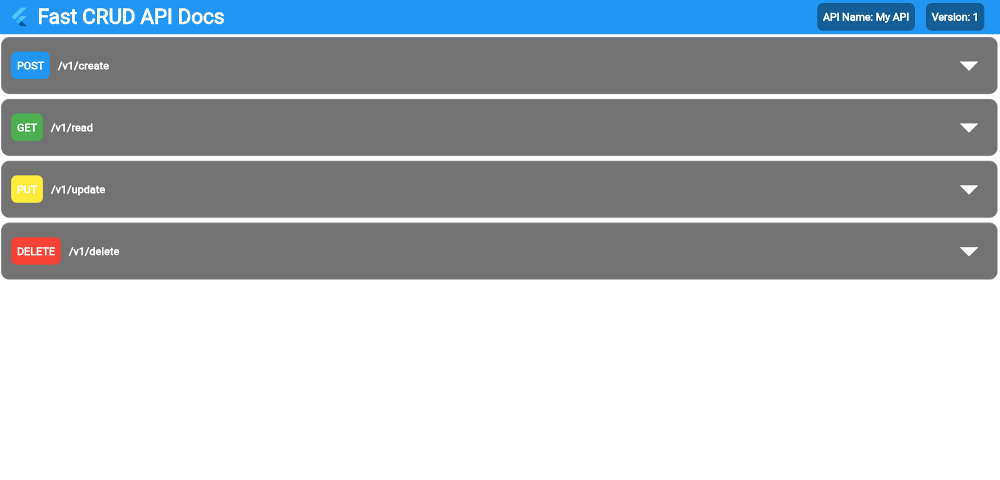

<p align="center">
  
</p>

A lightweight, customizable, easy-to-use package to create simple CRUD (Create, Read, Update, Delete) APIs. It uses the `shelf` package for building web servers and supports CRUD and custom routes.

<p align="center">
</a>
  <a href="https://github.com/DylanScottMickelson/fast_crud_api">
    
  </a>
  <a href="LICENSE">
    
  </a>
  <a href="https://github.com/sponsors/DylanScottMickelson">
    
  </a>
</p>

## 📃 Features

* Default simple 4-endpoint CRUD API server
* Customizable with custom endpoints or a combination of both
* Supports HTTP methods: GET, POST, PUT, and DELETE
* CORS middleware enabled (Default "*" Allow All) (Must be changed for Production!) 
* Logging for debugging purposes (default off)

## 📖 Table of Contents

1. [Getting Started](#getting-started)
2. [Installation](#installation)
3. [Usage](#usage)
   * [Creating a new API server](#create)
   * [Customizing your API](#custom)
   * [Access your API](#access)
4. [License](#license)

## 🟢 Getting Started <a name="getting-started"></a>

To get started with `fast_crud_api`, make sure you have either the Flutter SDK or the Dart SDK installed. You can find the installation instructions for both in their respective official documentation:

* [Flutter](https://docs.flutter.dev/install)
* [Dart](https://dart.dev/get-dart)

## 💽 Installation <a name="installation"></a>

Add `fast_crud_api` and `shelf` dependencies to your `pubspec.yaml` file:

```yaml
dependencies:
  shelf: any
  fast_crud_api:
    git:
      url: https://github.com/DylanScottMickelson/fast_crud_api.git
```

Now, run `flutter pub get` or `dart pub get` in your terminal/command prompt to install the package and its dependencies.

## ⚙️ Usage <a name="usage"></a>

### 🖥️ Creating a new API server <a name="create"></a>

To create a new instance of the `APIServer` class, you'll need to provide it with the following parameters:

* `create`, `read`, `update`, and `delete` functions for handling CRUD requests (optional) `Future<Response> handler(Request request)`
* Port number for the server (optional) (default 6969) `int port`
* Version number for your API (optional) (default 1)  `int version`
* Name your API (optional)  `String apiName`
* A list of custom routes (optional) `List<CustomRoute> endpoints`
* Whether to enable logging or not (optional) (default false) `bool logger`
* Not using CRUD. (defaults to false) `bool noCRUD`

Here's an example:

```dart
import 'package:fast_crud_api/fast_crud_api.dart';
import 'package:shelf/shelf.dart';

void main() async {
  /// Define your create, read, update, and delete functions here...
  Future<Response> createFunction(Request request) async {
    return Response.ok("Created!");
  }

  Future<Response> readFunction(Request request) async {
    return Response.ok("Read!");
  }

  Future<Response> updateFunction(Request request) async {
    return Response.ok("Updated!");
  }

  Future<Response> deleteFunction(Request request) async {
    return Response.ok("Deleted!");
  }

  final apiServer = APIServer(
    create: (request) => createFunction(request),
    read: (request) => readFunction(request),
    update: (request) => updateFunction(request),
    delete: (request) => deleteFunction(request),
    port: 6969,
    version: 1,
    apiName: "My API",
    noCRUD: false,
    logger: true,
  );

  await apiServer.start();
}

```

### ✏️ Customizing your API <a name="custom"></a>

To customize your API, you can define custom routes and their corresponding handlers as `CustomRoute` objects. These custom routes will be added to the main server in addition to the default CRUD endpoints if enabled.

Here's an example:

```dart
import 'dart:convert';

import 'package:fast_crud_api/custom_route.dart';
import 'package:fast_crud_api/fast_crud_api.dart';
import 'package:shelf/shelf.dart';

void main() async {
  /// Define your custom endpoints here...
  final customRoute1 = CustomRoute(
    endpoint: "users",
    method: "GET",
    handler: (request) => Response.ok(jsonEncode({"users": []})),
  );

  final apiServer = APIServer(
    port: 6969,
    version: 1,
    apiName: "My API",
    noCRUD: true,
    logger: true,
    routes: [customRoute1],
  );

  await apiServer.start();
}

```

<p align="center">
  
</p>

### 👨‍💻 Access Docs UI: <a name="access"></a>

Production:
Go to http://ip_address:chosen_port/api/docs/

Test:
Go to http://127.0.0.1:6969/api/docs/

### 🧑‍💻 Access the CRUD endpoints by sending an HTTP request to:

Production:
- http://ip_address:chosen_port/v{version_number}/create 
- http://ip_address:chosen_port/v{version_number}/read
- http://ip_address:chosen_port/v{version_number}/update 
- http://ip_address:chosen_port/v{version_number}/delete 

Test:
- http://127.0.0.1:6969/v1/create
- http://127.0.0.1:6969/v1/read
- http://127.0.0.1:6969/v1/update
- http://127.0.0.1:6969/v1/delete

### 💻 Access Custom endpoints by sending an HTTP request to: 

Production: 
- http://ip_address:chosen_port/v{version_number}/your/custom/route

Test:
- http://127.0.0.1:6969/v1/your/custom/route

## 🪪 License <a name="license"></a>

`fast_crud_api` is licensed under the MIT license. See the [LICENSE](./LICENSE) file for more information.
